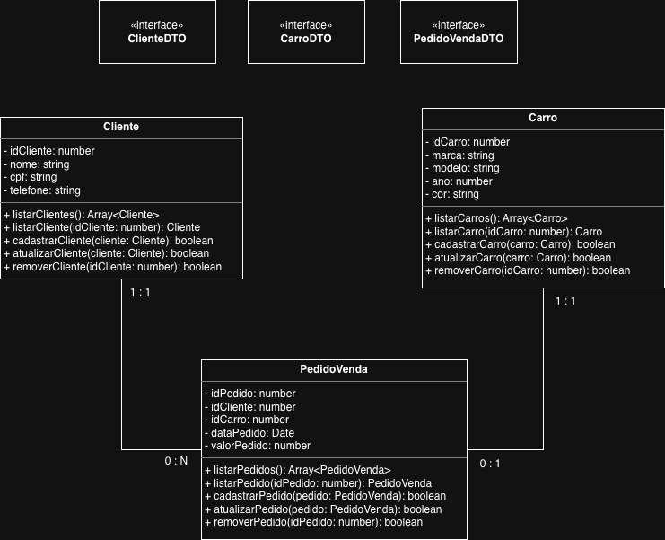

# 🚗 Projeto Integrador — EliteCar API

## 📖 Visão Geral
O **Projeto EliteCar** tem como objetivo **digitalizar e otimizar o gerenciamento de estoque de veículos** da concessionária **EliteCar**, uma empresa em expansão que comercializa carros novos e seminovos.  
Atualmente, a empresa enfrenta dificuldades devido ao uso de planilhas e formulários manuais, resultando em atrasos, inconsistências e falhas de comunicação entre os setores.

Para solucionar esse problema, os alunos foram contratados para **desenvolver uma API RESTful completa** e uma **interface web básica** para gerenciamento do catálogo de veículos.

---

## 🎯 Objetivo do Projeto
Criar uma **solução tecnológica integrada** composta por:
- Uma **API RESTful** com operações **CRUD (Criar, Ler, Atualizar, Deletar)** para gerenciamento de veículos.
- Uma **interface web** simples para consumir a API e exibir os dados do catálogo.

O sistema deverá ser **seguro, escalável e padronizado**, servindo de base para futuras integrações (como módulos de vendas e financiamento).

---

## ⚙️ Requisitos Técnicos

### 1. **Modelagem e Persistência de Dados**
- Modelar o banco de dados relacional (mínimo: tabelas `Veículos` e `Marcas`).
- Utilizar **PostgreSQL** como SGBD.
- Implementar operações CRUD seguras e padronizadas.

### 2. **Lógica de Negócios e API**
- Desenvolver o **Back-End** em **TypeScript**.
- Criar endpoints REST (GET, POST, PUT, DELETE).
- Garantir boas práticas de código, segurança e integridade dos dados.

### 3. **Interface Web**
- Desenvolver página em **HTML e CSS**.
- Utilizar **JavaScript** para consumir a API via requisições assíncronas.
- Exibir lista de veículos e detalhes individuais.

### 4. **Gestão de Projeto**
- Adotar um método ágil (**Scrum ou Kanban**).
- Manter documentação técnica (DER, endpoints e decisões de projeto).

---

## Diagrama de Classes

---

## 📦 Entregáveis

1. **Modelo de Dados e Banco de Dados**
   - Script SQL de criação (PostgreSQL).
   - Diagrama MER/DER documentado.

2. **API RESTful**
   - Aplicação em TypeScript com operações CRUD completas.
   - Documentação dos endpoints.

3. **Interface Web**
   - Página HTML/CSS/JS interagindo com a API.
   - Exibição de catálogo e detalhes de veículos.

4. **Documentação do Projeto**
   - Plano de desenvolvimento.
   - Cronograma e divisão de tarefas.
   - Justificativas técnicas e reflexões analíticas.

---

## 🧩 Metodologia de Desenvolvimento
O projeto será desenvolvido **sob orientação docente**, utilizando a metodologia **SENAI de Educação Profissional (MSEP)**, que combina teoria e prática através de **situações de aprendizagem desafiadoras**.  
O foco está no **desenvolvimento de competências técnicas e autonomia profissional**, preparando os alunos para projetos futuros com **autogestão**.

---

## 👩‍💻 Papel dos Alunos
- Participar ativamente das aulas e práticas.
- Implementar o projeto conforme os requisitos de qualidade e segurança.
- Tirar dúvidas, testar, documentar e aprimorar continuamente o código.
- Desenvolver autonomia para futuros desafios técnicos.

---

## 🧠 Capacidades Desenvolvidas
- Modelagem e implementação de banco de dados relacional.  
- Programação de APIs RESTful em TypeScript.  
- Integração entre front-end e back-end.  
- Aplicação de metodologias ágeis e boas práticas de desenvolvimento.  
- Trabalho em equipe e pensamento analítico.

---

## 🏁 Resultado Esperado
Ao final, espera-se que os alunos entreguem uma **solução funcional e documentada**, demonstrando:
- Domínio técnico nas etapas de desenvolvimento web.  
- Capacidade de trabalho colaborativo.  
- Compreensão da importância da integração entre teoria e prática.  
